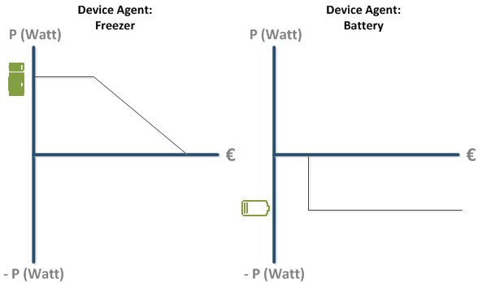
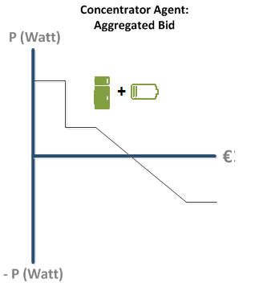

# Aggregation

Dear reader, this section might just be one of the most important concepts behind the PowerMatcher! It explains Bid Aggregation and allows the PowerMatcher to scale to a very large network of connected Devices.

-------------------------

# Bid Aggregation

Bids are send higher up the hierarchy where they are received by the parent agent. 


A parent agent is always a Concentrator or Auctioneer agent.

In the following example two Device Agents, the Freezer and the Battery send out a Bid which is received by the Concentrator Agent: the House. 



The Concentrator agent aggregates the received bid curves and composes a new single Bid. Aggregation simply means adding Bids, since a production Bid is 'negative' it is automatically subtracted.



Take a moment to fully understand this concept!  **An aggregated Bid represents the net demand of a sub cluster**.   It means that within the sub cluster of the House there are two devices that cancel each other out at a particular price level. E.g. The Freezer was willing to consume 200W at a price of 0,30 cents/kW and the battery was willing to discharge at 200W at a price of 0,30 cents/kW. 

After aggregation of all child agent bid curves a new aggregated bid curve is composed that resembles the full **net** demand **as a function of the price**. 

-------------------

# Technical Implementation

At some point in time, due to a new event or scheduling(see [Events & Scheduling](Events & Scheduling), an Agent is activated to aggregate it's latest Bids in the Bidcache. This `bidCache.aggregate()` is activated in the [BaseMatcherEndpoint](https://github.com/flexiblepower/powermatcher/blob/master/net.powermatcher.core/src/net/powermatcher/core/BaseMatcherEndpoint.java).

```
   private final Runnable bidUpdateCommand = new Runnable() {
        @Override
        public void run() {
            try {
                if (isInitialized()) {
                    performUpdate(bidCache.aggregate());
```
Bids are stored in a [Bidcache](https://github.com/flexiblepower/powermatcher/blob/master/net.powermatcher.core/src/net/powermatcher/core/BidCache.java), an object that lives aside every Concentrator or Auctioneer. The BidCache keeps track of all Bids that are currently known to the Agent.

For more detailed information on aggregation please continue reading in the [Javadoc]().
