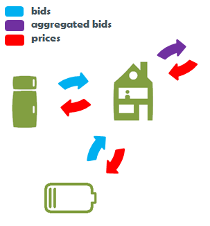

# Aggregation

Dear reader, this section might just be one of the most important concepts behind the PowerMatcher! It explains Bid Aggregation and allows the PowerMatcher to scale to a very large network of connected Devices.

-------------------------

# Bid Aggregation

Bids are send higher up the hierarchy where they are received by the parent agent. 



A parent agent is always a Concentrator or Auctioneer agent.

In the following example two Device Agents, the Freezer and the Battery send out a Bid which is received by the Concentrator Agent: the House. 


The Concentrator agent aggregates the received bid curves and composes a new single Bid. Aggregation simply means adding Bids, since a production Bid is 'negative' it is automatically subtracted.


Take a moment to fully understand this concept!  **An aggregated Bid represents the net demand of a sub cluster**.   It means that within the sub cluster of the House there are two devices that cancel each other out at a particular price level. E.g. The Freezer was willing to consume 200W at a price of 0,30 cents/kW and the battery was willing to discharge at 200W at a price of 0,30 cents/kW. 

After aggregation of all child agent bid curves a new aggregated bid curve is composed that resembles the full **net** demand **as a function of the price**. 

-------------------

# Technical Implementation

Bids are stored in a [Bidcache](https://github.com/flexiblepower/powermatcher/blob/master/net.powermatcher.core/src/net/powermatcher/core/BidCache.java), an object that lives aside every Concentrator or Auctioneer. The BidCache keeps track of all Bids that are currently known to the Agent.

```
public class BidCache {
    private final MarketBasis marketBasis;

    private final Map<String, BidUpdate> agentBids;

    private volatile boolean bidChanged;
    private transient AggregatedBid lastBid;
```
Where the `Map` keeps track of the latest BidUpdates and always represents the latest State. `AggregatedBid` is the latest reflection of all BidUpdates aggregated into a single aggregated bid that was sent up the hierarchy.

Once a BidUpdate arrives, it is updated in the BidCache Map:

```
    public void updateAgentBid(String agentId, BidUpdate bid) {
        if (bid == null) {
            agentBids.remove(agentId);
        } else if (!bid.getBid().getMarketBasis().equals(marketBasis)) {
            throw new IllegalArgumentException("The marketBasis of the bid does not match the marketBasis of this BidCache");
        } else {
            bidChanged = true;
            agentBids.put(agentId, bid);
        }
    }
```

At some point in time, due to a new event or scheduling(see [Events & Scheduling](Events & Scheduling)), an Agent is activated to aggregate it's latest Bids in the Bidcache. This `bidCache.aggregate()` is activated in the [BaseMatcherEndpoint](https://github.com/flexiblepower/powermatcher/blob/master/net.powermatcher.core/src/net/powermatcher/core/BaseMatcherEndpoint.java).

```
   private final Runnable bidUpdateCommand = new Runnable() {
        @Override
        public void run() {
            try {
                if (isInitialized()) {
                    performUpdate(bidCache.aggregate());
```

The `aggregate()` function in bidCache looks as follows;  


```
    public AggregatedBid aggregate() {
        if (!bidChanged && lastBid != null) {
            return lastBid;
        }

        AggregatedBid.Builder builder = new AggregatedBid.Builder(marketBasis);
        for (Entry<String, BidUpdate> entry : agentBids.entrySet()) {
            builder.addAgentBid(entry.getKey(), entry.getValue());
        }

        synchronized (this) {
            lastBid = builder.build();
            bidChanged = false;

            return lastBid;
        }
    }
```

As you can see it kicks of the Builder pattern in the `AggregatedBid` Object. As we mentioned earlier: "AggregatedBid is the latest reflection of all BidUpdates aggregated into a single aggregated bid that was sent up the hierarchy." The Builder pattern is executed in the AggregatedBid object where it completely rebuilds a new AggregatedBid from the ground up with all the latest Bids that are present in the Map `agentBids`

The Builder Pattern in [AggregatedBid](https://github.com/flexiblepower/powermatcher/blob/master/net.powermatcher.core/src/net/powermatcher/core/bidcache/AggregatedBid.java):

```
        public Builder addAgentBid(String agentId, BidUpdate bidUpdate) {
            if (!agentBidReferences.containsKey(agentId) && bidUpdate.getBid().getMarketBasis().equals(marketBasis)) {
                agentBidReferences.put(agentId, bidUpdate.getBidNumber());
                addBid(bidUpdate.getBid());
            }

            return this;
        }
```
