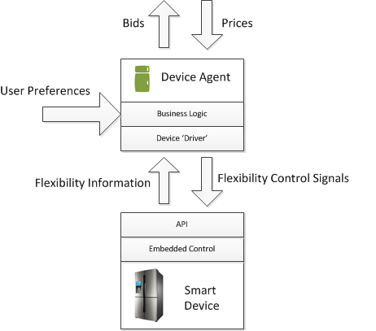
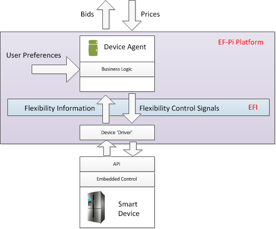

# EF-Pi & PowerMatcher integration

In [Device Agent Bids](Bids.md) we have explained how an Agent represents a smart device in the PowerMatcher ecosystem:

But as you can see there needs to be a bi-directional connection between the Device Agent and the smart device for this to work. Over bi-directional communication `flexibility information` and `flexibility control signals` are exchanged.

The EF-Pi solution lays a cut in this bi-directional communication and implements the "Energy Flexibility Interface", "EFI"in short, which is positioned in between the smart device and the agent.

Why?

Because this allows us to decouple the business logic from vendor specific API's. The business logic now only has to communicate with a standardized interface: a standard set of parameters. EF-Pi takes care of the actual communication with the device API.

Please read the [EF-Pi documentation](http://fpai-ci.sensorlab.tno.nl/builds/fpai-documentation/v14.10/html/) for more information on the EF-Pi concept.

The EFI defines four abstract type of devices in a holistic energy system. These devices can consume and/or produce and could be flexible in some way. The four abstraction types are:

1. [Uncontrollable](http://fpai-ci.sensorlab.tno.nl/builds/fpai-documentation/v14.10/html/UncontrolledEFI.html), e.g. PV panel, windturbine  
2. [Unconstrained](http://fpai-ci.sensorlab.tno.nl/builds/fpai-documentation/v14.10/html/UnconstrainedEFI.html), e.g. a generator
3. [Timeshifter](http://fpai-ci.sensorlab.tno.nl/builds/fpai-documentation/v14.10/html/TimeshiftableEFI.html), e.g. a washing maschine, industrial heater
4. [Buffer](http://fpai-ci.sensorlab.tno.nl/builds/fpai-documentation/v14.10/html/BufferStorageEFI.html), e.g. a battery, a freezer

What this means is that the PowerMatcher can get away with 4 simple agents that map to each of these abstractions. For instance in the case of the Timeshifter; the PowerMatcher doesn't care whether it is an industrial heater or washing machine. To the PowerMatcher the device is a "Timeshifter" and accordingly has some business logic to develop a Bid that represents the Timeshifter. 

The device agents that specifically map to the EF-Pi abstractions can be found in this [Repo](https://github.com/flexiblepower/fpai-apps/tree/development/net.powermatcher.fpai.controller/src/net/powermatcher/fpai/agents)
