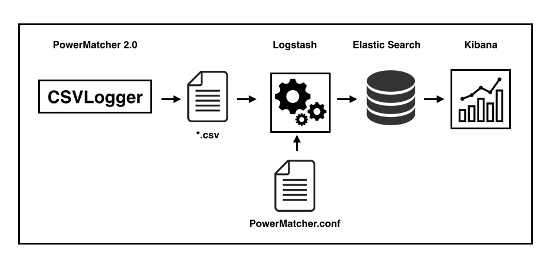

# Monitoring with CSVLogger and KLE Stack

This section provides a small tutorial on how to implement the KLE stack on top of the CSVLogger. The KLE stack will make it much easier to visually monitor the status of your cluster.

## KLE stack
The KLE stack stands for [(K)ibana](http://www.elasticsearch.org/overview/kibana/), [(L)ogstash](http://logstash.net) and [(E)lastic Search](http://www.elasticsearch.org/) stack. The figure below represents the example/test PM monitoring setup.

First we have to configure a CSVLogger component in Felix web console. This logger will produce CSV logfiles. A Logstash Agent will read and parse the log files to JSON events. The events are pushed to the Elastic Search database. With the Kibana frontend we are able to construct several monitoring dashboards.

## CSVLogger

## Elastic Search
- Download the latest version on http://www.elasticsearch.org/overview/elkdownloads/
- Unzip Elastic Search
- Run `bin/elasticsearch` on Unix,or `bin/elasticsearch.bat` on Windows
- Open your browser and surf to http://localhost:9200/

## Logstash
- Download Logstash at http://www.elasticsearch.org/overview/logstash/download/
- Unzip Logstash
- Prepare a `logstash-powermatcher.conf` config file
- Run `bin/logstash agent -f logstash-powermatcher.conf`
- An example Power Matcher logstash config file [can be found here](logstash-powermatcher.conf)
- Replace `${LOG_PATH}` in the conf file with the path to the CSVLogger files

## Kibana
- Download the latest version of Kibana http://www.elasticsearch.org/overview/kibana/installation/
- Extract the archive
- Open `config/kibana.yml` in an editor
- Check if  the elasticsearch url points to your Elasticsearch instance
- Run `./bin/kibana` (or `bin/kibana.bat` on windows)
- Point your browser at http://yourhost.com:5601
- More information can be found on https://github.com/elasticsearch/kibana/blob/master/README.md