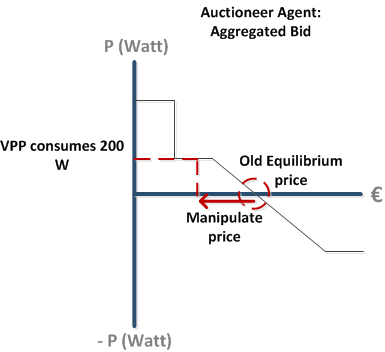
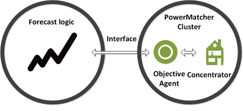
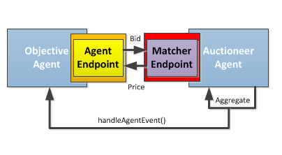

# Cluster Objectives

The Objective Agent interfaces with the business logic of an external application on one side; and with the PowerMatcher on the other side. 


**Figure 1 - Function of an ObjectiveAgent**

For example, if you want the PowerMatcher cluster to serve as a Virtual Power Plant (VPP), NOT to balance itself, but instead have it produce or consume **a surplus** amount of energy. This means you have to push the PowerMatcher market out of balance and thus NOT forward the Equilibrium price, instead *manipulate* the price in the PowerMatcher market. This can be done using the Objective Agent.



**Figure 2 - A VPP Objective Agent will manipulate the price to have the cluster produce or consume energy**

This is just one example for using the Objective Agent, an Objective Agent could also be used to feed another Agent with forecasts.



**Figure 3 - A Forecast Objective Agent will manipulate the Agent to achieve better long term results**

---------------------------------------------------------------

## The Objective Agent 

The Objective Agent implements the `AgentObserver` the configuration parameter which agent to observe is set in OSGi.

In the [Example Objective Agent](https://github.com/flexiblepower/powermatcher/blob/master/net.powermatcher.examples/src/net/powermatcher/examples/ObjectiveAgent.java)
the Auctioneer is observed.



**Figure 4 - The Objective Agent observes the Auctioneer**

When the Auctioneer constructs an `AggregatedBid` it will notify the ObjectiveAgent through the observer that a new 'AggregatedBid' has been created.
The ObjectiveAgent can use this information to construct his own Bid and influence the Auctioneer. The ObjectiveAgent bid will be send to the Auctioneer just like any other Agent, through the `AgentEndpoint`.

## Technical Implementation

The Auctioneer publishes an `AggregatedBidEvent`:

```
        @Override
        public void run() {
            final Agent.Status currentStatus = getStatus();
            try {
                if (currentStatus.isConnected()) {
                    AggregatedBid aggregatedBid = bidCache.aggregate();
                    publishEvent(new AggregatedBidEvent(currentStatus.getClusterId(),
                                                        getAgentId(),
                                                        now(),
                                                        aggregatedBid));
                    performUpdate(aggregatedBid);
                }
            } catch (RuntimeException e) {
                LOGGER.error("doBidUpate failed for matcher " + getAgentId(), e);
            } finally {
                synchronized (this) {
                    bidUpdateSchedule = null;
                    coolDownEnds = context.currentTimeMillis() + minTimeBetweenUpdates;
                }
            }
        }
``` 

And the ObjectiveAgent's `handleAgentEvent()` will be called, and extracts the `AggregatedBid`:

```

    @Override
    public void handleAgentEvent(AgentEvent event) {
        // We are only interested in AggregatedBidEvents
        if (event instanceof AggregatedBidEvent) {
            handleAggregatedBid(((AggregatedBidEvent) event).getAggregatedBid());
        }
    }

```