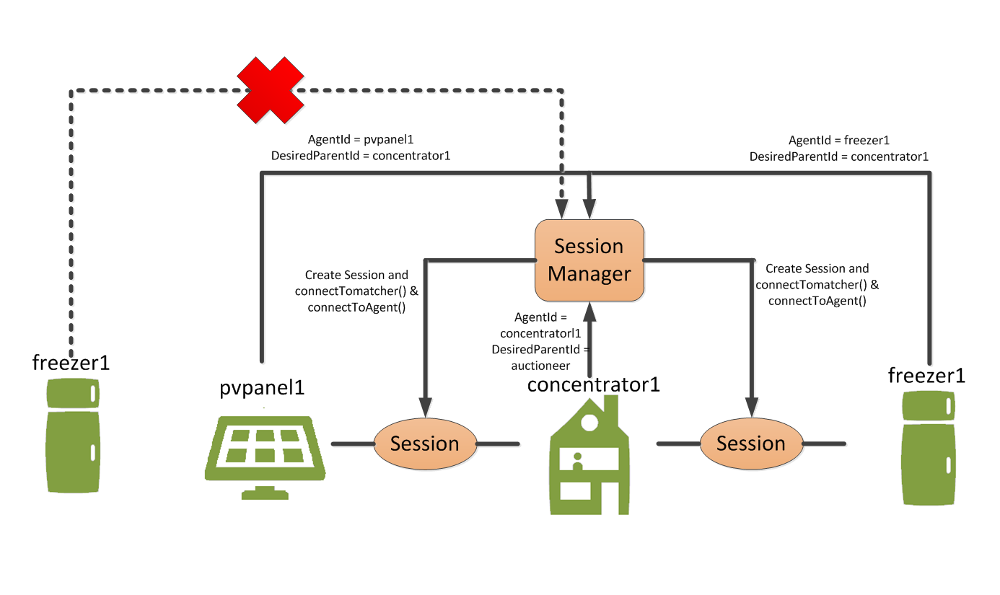

# Sessions

Agents don't connect directly, **they connect through** ["Sessions"](https://github.com/flexiblepower/powermatcher/blob/master/net.powermatcher.api/src/net/powermatcher/api/Session.java). Sessions are really handy because they help us a lot later on  when we explain setting up a distributed system with remote agents on physically separated computers.
***


**Figure 1 - Connection with Sessions**

The [Session Manager](https://github.com/flexiblepower/powermatcher/blob/master/net.powermatcher.runtime/src/net/powermatcher/runtime/SessionManager.java) receives the necessary information from OSGI; it will create a new [SessionImpl Object](https://github.com/flexiblepower/powermatcher/blob/master/net.powermatcher.runtime/src/net/powermatcher/runtime/SessionImpl.java) where it connects two Agents by calling `connectToAgent()` and `connectToMatcher()` and it tells both Agents to communicate over that Session. 

There is one slight problem with how the PowerMatcher was designed: MatcherEndpoints and AgentEndpoints can be called into life in no particular order. However the PowerMatcher has to be built from the top->down. The reason for this is that the Auctioneer (top of the tree) defines the MarketBasis (see [Bids & Prices](DataObjects.md)), and for an Agent to become active it needs the MarketBasis.

To solve this problem the [Potential Session](https://github.com/flexiblepower/powermatcher/blob/master/net.powermatcher.runtime/src/net/powermatcher/runtime/PotentialSession.java) was created. The PotentialSession allows for coupling Matcher- and Agent Endpoints without activating them. A PotentialSession will only be turned into an actual session: `SessionImpl` when the rest of cluster tree that leads to that Session has already become active.

However, it should also be possible for an Agent to initiate a connection by itself. For instance a Device Agent wants to connect to a particular Concentrator. 

## Self-establishing connection
---------------------------------


**Figure 2 - Automatic connection in sessionManager**

Instead of manually wiring each of the Agents it is desirable that an Agent can connect to the PowerMatcher cluster if it knows where to connect. The Agent informs the SessionManager (this could be from a remote location) that he wants to connect to a specific agent; how to do this? Well..

* An agent has two important ID’s: The **agentId** and the **desiredParentId**. 
* The agentId is his own ID.
* The desiredParentId is the ID the Agent wants to connect with.

In Figure 2 you can see the ID’s of the agents.

* DeviceAgent: 	agentId = DeviceAgent, desiredParentId = Concentrator.
* Concentrator:	agentId = Concentrator, desiredParentId = Auctioneer.
* Auctioneer:	agentId = Auctioneer, desiredParentId = NULL.

Resulting Sessions: "DeviceAgent:Concentrator"  or "Concentrator:Auctioneer"

## Technical Implementation
---------------------------------

The SessionManager has two important functions that can be called from the OSGI config admin or from a remote Agent: `addAgentEndpoint()` and `addMatcherEndpoint()`. 

When constructing a new [SessionImpl](https://github.com/flexiblepower/powermatcher/blob/master/net.powermatcher.runtime/src/net/powermatcher/runtime/SessionImpl.java) the SessionManager will set the AgentEndpoint and MatcherEndpoint:

```
   public SessionImpl(AgentEndpoint agentEndpoint, MatcherEndpoint matcherEndpoint, PotentialSession potentialSession) {
        sessionId = UUID.randomUUID().toString();
        this.agentEndpoint = agentEndpoint;
        this.matcherEndpoint = matcherEndpoint;
        this.potentialSession = potentialSession;
        clusterId = matcherEndpoint.getClusterId();
    }
```

But it will also call the functions `connectToMatcher()` and `connectToAgent()` at each of the Agent's interfaces to connect both Agents through that Session:

`    private volatile Session session;
`

```

    /**
     * {@inheritDoc}
     */
    @Override
    public synchronized void connectToMatcher(Session session) {
        if (this.session != null) {
            throw new IllegalStateException("Already connected to agent " + session.getMatcherId());
        }

        configure(session.getMarketBasis(), session.getClusterId());
        bidNumberGenerator.set(0);
        this.session = session;
    }

```

For more detailed information on the role of the PotentialSession please check the [Javadoc]().

---------------------------------

# Agent Uniqueness

Agent Uniqueness feature checks that there are no name collisions in the cluster; this could otherwise lead to strange behaviour of a single agent connecting to multiple parents. 


**Figure 3: Agent Uniqueness**

When an agent wants to connect to the cluster, the SessionManager will check the uniqueness of the agentId.
If there is no agentId connected to the cluster with the same agentId, the connection will be made successfully. 

However, if the agentId already exists, PowerMatcher will log that the agentId is already registered in the cluster and doesn’t allow the connection.

When activating the agent in the configuration admin of Felix, it is not possible to add that existing agentId.