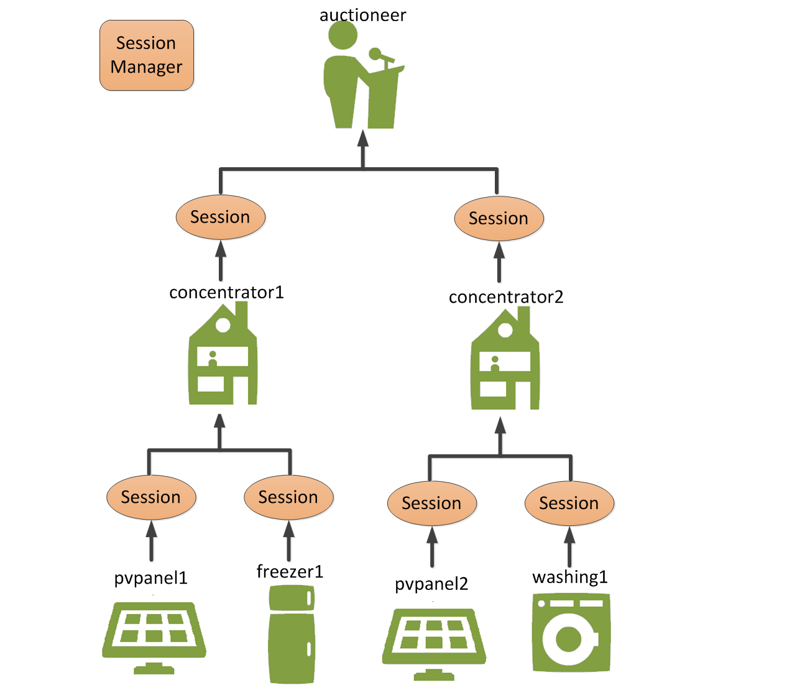
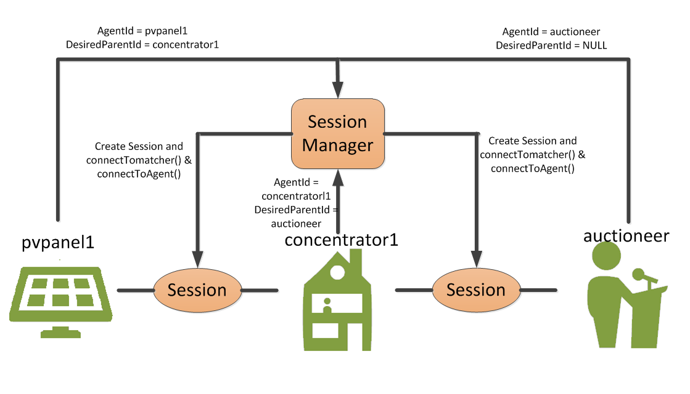

# Sessions

Agents don't connect directly, **they connect through** [["Sessions"|https://github.com/flexiblepower/powermatcher/blob/master/net.powermatcher.api/src/net/powermatcher/api/Session.java]]. Sessions are really handy because this concept helps us a lot later on  when we explain setting up a distributed system with remote agents on physically seperated computers.
***



**Figure 1 - Connection with Sessions**

The [[Session Manager|https://github.com/flexiblepower/powermatcher/blob/master/net.powermatcher.runtime/src/net/powermatcher/runtime/sessions/SessionManager.java]] receives the necessary information from OSGI; it will create a new [[Session Object|https://github.com/flexiblepower/powermatcher/blob/master/net.powermatcher.runtime/src/net/powermatcher/runtime/sessions/SessionImpl.java]] where it connects two Agents by calling `connectToAgent()` and `connectToMatcher()` and it tells both Agents to communicate over that Session. 

There is one slight problem with how the PowerMatcher was designed: MatcherEndpoints and AgentEndpoints can be called into life in no particular order. However the PowerMatcher has to be built from the top->down. The reason for this is that the Auctioneer (top of the tree) defines the MarketBasis (see Data Objects), and for an Agent to become active it needs the MarketBasis.

To solve this problem the [[Potential Session|https://github.com/flexiblepower/powermatcher/blob/master/net.powermatcher.runtime/src/net/powermatcher/runtime/sessions/PotentialSession.java]] was created. The PotentialSession allows for coupling Matcher- and Agent Endpoints without activating them. A PotentialSession will only be turned into an actual session: `SessionImpl` when the rest of cluster tree that leads to that Session has already become active.

However, it should also be possible for an Agent to iniate a connection by itself. For instance a Device Agent wants to connect to a particular Concentrator. 

## Self-establishing connection
---------------------------------


**Figure 2 - Automatic connection in sessionManager**

Instead of manually wiring each of the Agents it is desirable that an Agent can connect to the PowerMatcher cluster if it knows where to connect. The Agent informs the SessionManager (this could be from a remote location) that he wants to connect to a specific agent; how to do this? Well..

* An agent has two important ID’s: The **agentId** and the **desiredParentId**. 
* The agentId is his own ID.
* The desiredParentId is the ID the Agent wants to connect with.

In Figure 2 you can see the ID’s of the agents.

* DeviceAgent: 	agentId = DeviceAgent, desiredParentId = Concentrator.
* Concentrator:	agentId = Concentrator, desiredParentId = Auctioneer.
* Auctioneer:	agentId = Auctioneer, desiredParentId = NULL.

Resulting Sessions: "DeviceAgent:Concentrator"  or "Concentrator:Auctioneer"

## Technical Implemenation
---------------------------------

The SessionManager has two important functions that can be called from the OSGI config admin or from a remote Agent: `addAgentEndpoint()` and `addMatcherEndpoint()`. One of the functions is described below:

```
    @Reference(dynamic = true, multiple = true, optional = true)
    public void addAgentEndpoint(AgentEndpoint agentEndpoint) {
        String agentId = agentEndpoint.getAgentId();
        String matcherId = agentEndpoint.getDesiredParentId();
        synchronized (this) {
            if (!potentialSessions.containsKey(matcherId)) {
                potentialSessions.put(matcherId, new ArrayList<PotentialSession>());
            }
            // Check if it already exists
            for (PotentialSession ps : potentialSessions.get(matcherId)) {
                if (agentId.equals(ps.getAgentId())) {
                    LOGGER.warn("AgentEndpoint added with agentId " + agentId
                                + ", but it already exists. Ignoring the new one...");
                    return;
                }
            }

            PotentialSession ps = new PotentialSession(agentEndpoint);

            //check if MatcherEndpoint was created before the AgentEndpoint, if so add it to the PotentialSession. 
            //otherwise it will fail     
            ps.setMatcherEndpoint(matcherEndpoints.get(matcherId));

            //add new PotentialSession to lookup list
            potentialSessions.get(matcherId).add(ps);
        }
        tryConnect();
    }
```

There is one slight problem with how the PowerMatcher was designed: MatcherEndpoints and AgentEndpoints can be called into life in no particular order. However the PowerMatcher has to be built from the top->down. The reason for this is that the Auctioneer (top of the tree) defines the MarketBasis (see [[Data Objects|DataObjects]]), and for an Agent to become active it needs the MarketBasis. 

To solve this problem the `PotentialSession` was created. The PotentialSession allows for coupling Matcher- and Agent Endpoints without activating them. So when an AgentEndpoint is created it will create a PotentialSession and see if the MatcherEndpoint is already online and bring them together in a PotentialSession...

```
            //check if MatcherEndpoint was created before the AgentEndpoint, if so add it to the PotentialSession. 
            //otherwise it will fail     
            ps.setMatcherEndpoint(matcherEndpoints.get(matcherId));

            //add new PotentialSession to lookup list
            potentialSessions.get(matcherId).add(ps);
```

And vice versa, a MatcherEndpoint might have been created before the AgentEndpoint...it will look through PotentialSessions to see if any AgentEndpoint wants to connect with him.

```
    @Reference(dynamic = true, multiple = true, optional = true)
    public void addMatcherEndpoint(MatcherEndpoint matcherEndpoint) {
        String agentId = matcherEndpoint.getAgentId();

        synchronized (this) {
            // Check for duplicate
            if (matcherEndpoints.containsKey(agentId)) {
                LOGGER.warn("MatcherEndpoint added with agentId " + agentId
                            + ", but it already exists. Ignoring the new one...");
                return;
            }

            if (!potentialSessions.containsKey(agentId)) {
                potentialSessions.put(agentId, new ArrayList<PotentialSession>());
            }
            matcherEndpoints.put(agentId, matcherEndpoint);

            //check if AgentEndpoint was created before the MatcherEndpoint, if so add yourself to the PotentialSession. 
            /otherwise it will fail     
            for (PotentialSession ps : potentialSessions.get(agentId)) {
                ps.setMatcherEndpoint(matcherEndpoint);
            }
        }

        tryConnect();
    }
```

If both are online they will come together in a PotentialSession. `tryConnect()` in the `SessionManager` will run over all PotentialSessions trying to turn PotentialSession into actual Session wherever possible. A PotentialSession will only be turned into an actual session: `SessionImpl` when the rest of cluster tree that leads to that Session has already become active.

`PotentialSession.tryConnect()` will check if PotentialSession can be turned into an actual Session, a `SessionImpl`:

```    
public boolean tryConnect() {
        if (session == null && matcherEndpoint != null) {
            SessionImpl newSession = new SessionImpl(agentEndpoint, matcherEndpoint, this);
            if (matcherEndpoint.connectToAgent(newSession)) {
                // Success!
                session = newSession;
                agentEndpoint.connectToMatcher(newSession);
                LOGGER.debug("Connected MatcherEndpoint '{}' with AgentEndpoint '{}' with Session {}",
                             matcherEndpoint.getAgentId(),
                             agentEndpoint.getAgentId(),
                             newSession.getSessionId());
                return true;
            }
        }
        return false;
    }
```
When constructing a new [[SessionImpl|https://github.com/flexiblepower/powermatcher/blob/master/net.powermatcher.runtime/src/net/powermatcher/runtime/sessions/SessionImpl.java]] it will set the AgentEndpoint and MatcherEndpoint:

```
   public SessionImpl(AgentEndpoint agentEndpoint, MatcherEndpoint matcherEndpoint, PotentialSession potentialSession) {
        sessionId = UUID.randomUUID().toString();
        this.agentEndpoint = agentEndpoint;
        this.matcherEndpoint = matcherEndpoint;
        this.potentialSession = potentialSession;
        clusterId = matcherEndpoint.getClusterId();
    }
```

But it will also call the functions `connectToMatcher()` and `connectToAgent()` at each of the Agent's interfaces to connect both Agents through that Session:

`    private volatile Session session;
`


```

    /**
     * {@inheritDoc}
     */
    @Override
    public synchronized void connectToMatcher(Session session) {
        if (this.session != null) {
            throw new IllegalStateException("Already connected to agent " + session.getMatcherId());
        }

        configure(session.getMarketBasis(), session.getClusterId());
        bidNumberGenerator.set(0);
        this.session = session;
    }

```

---------------------------------
Agent Uniqueness feature checks that there are no name collisions in the cluster; this could otherwise lead to strange behaviour of a single agent connecting to multiple parents. For more information please read the [[Agent Uniquness| https://github.com/flexiblepower/powermatcher/wiki/UniqueAgent]] section.

------------------------------

Learn how events are generated and bring the PowerMatcher market to life in [[Events & Scheduling|Events & Scheduling]]